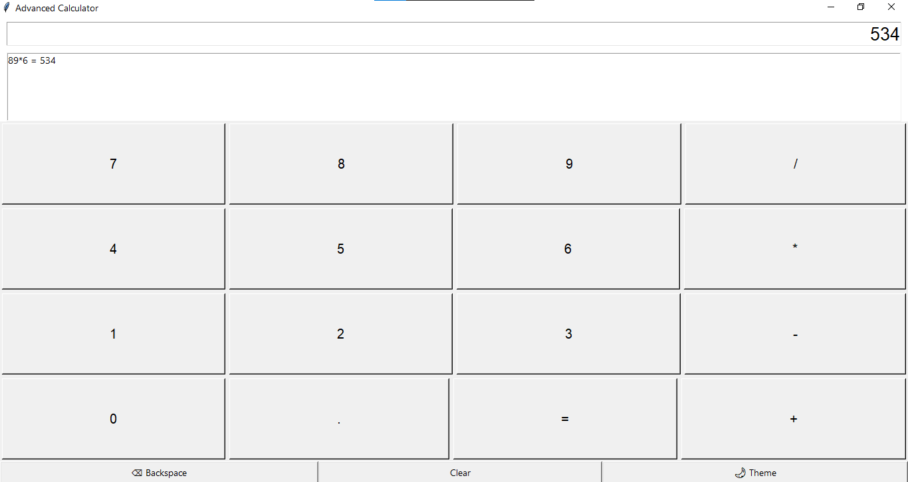
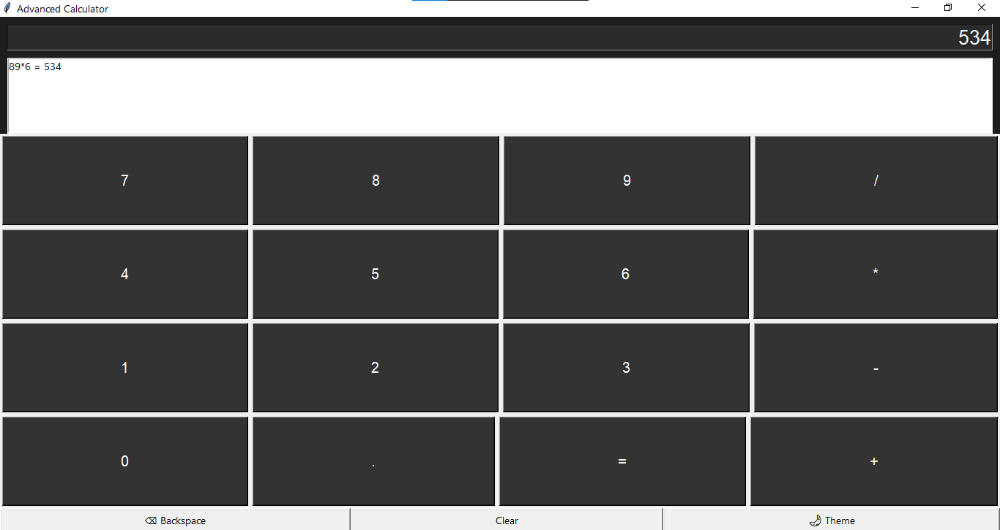

# 🧮 Advanced Calculator App (Python Tkinter)

A modern GUI-based calculator application built using Python and Tkinter, featuring a clean interface, dark mode, keyboard support, and calculation history.

---

## 🚀 Features

* ➕ Perform basic arithmetic operations (Addition, Subtraction, Multiplication, Division)
* ⌫ Backspace functionality
* ⌨️ Keyboard input support
* 🌙 Dark / Light mode toggle
* 🕘 Calculation history (last 5 entries)
* 🧹 Clear/reset option
* 🎨 Improved UI with styled buttons and responsive layout

---

## 🛠️ Technologies Used

* Python
* Tkinter (GUI Library)

---

## 📸 Screenshots

### 🔆 Light Mode



### 🌙 Dark Mode



---

## ▶️ How to Run

1. Install Python (3.x)
2. Clone this repository:

   ```bash
   git clone https://github.com/shruti875/calculator-app.git
   ```
3. Navigate to the project folder:

   ```bash
   cd calculator-app
   ```
4. Run the app:

   ```bash
   python calculator.py
   ```

---

## 📌 Project Highlights

* Demonstrates GUI development using Tkinter
* Implements event-driven programming
* Includes user-friendly features like history tracking and theme switching
* Designed with clean and structured code for easy understanding

---

## 🔮 Future Improvements

* Scientific calculator functions
* Better UI (rounded buttons, animations)
* Save history to file
* Convert into web app (Flask / React)

---

## 🙌 Author

**Shruti Vishwakarma**

---

⭐ If you like this project, consider giving it a star!